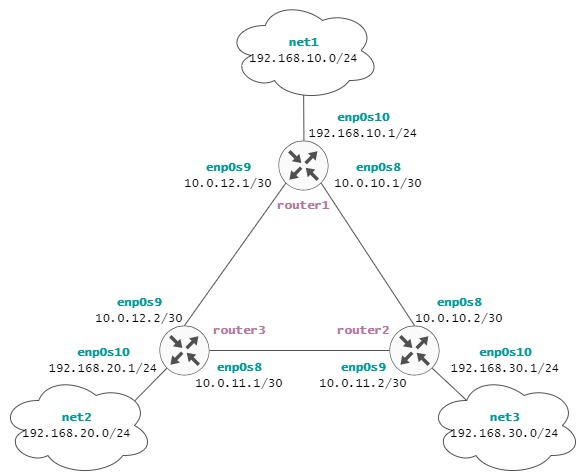

# Otus Homework 21. OSPF.
### Цель домашнего задания
Научится настраивать протокол OSPF в Linux-based системах.
### Описание домашнего задания
1. Развернуть 3 виртуальные машины
2. Объединить их разными vlan
    - настроить OSPF между машинами
    - изобразить ассиметричный роутинг
    - сделать один из линков "дорогим", но что бы при этом роутинг был симметричным
## Выполнение
С помощью vagrant развернем тестовый стенд:  
<table>
  <tr>
    <th>Название</th>
    <th>Интерфейс</th>
    <th>IP-адрес</th>
    <th>Описание</th>
  </tr>
  <tr>
    <th rowspan="3">router1</th>
    <td>enp0s8</td>
    <td>10.0.10.1/30</td>
    <td>router1 - router2</td>
  </tr>
    <td>enp0s9</td>
    <td>10.0.12.1/30</td>
    <td>router1 - router3</td>
  </tr>
  </tr>
    <td>enp0s10</td>
    <td>192.168.10.1/24</td>
    <td>Локальная сеть net1</td>
  </tr>
   <tr>
    <td colspan="3"></td>
  </tr>
  <tr>
    <th rowspan="3">router2</th>
    <td>enp0s8</td>
    <td>10.0.10.2/30</td>
    <td>router1 - router2</td>
  </tr>
    <td>enp0s9</td>
    <td>10.0.11.2/30</td>
    <td>router2 - router3</td>
  </tr>
  </tr>
    <td>enp0s10</td>
    <td>192.168.20.1/24</td>
    <td>Локальная сеть net2</td>
  </tr>
   <tr>
    <td colspan="3"></td>
  </tr>
  <tr>
    <th rowspan="3">router3</th>
    <td>enp0s8</td>
    <td>10.0.11.1/30</td>
    <td>router2 - router3</td>
  </tr>
    <td>enp0s9</td>
    <td>10.0.12.2/30</td>
    <td>router1 - router3</td>
  </tr>
  </tr>
    <td>enp0s10</td>
    <td>192.168.30.1/24</td>
    <td>Локальная сеть net3</td>
  </tr>
</table>
  
Виртуаульные машины соединены между собой подсетями *10.0.10.0/30*, *10.0.11.0/30* и *10.0.12.0/30*.  
У каждого устройства есть дополнительная сеть *192.168.10.0/24*, *192.168.20.0/24* и *192.168.30.0/24* соответственно.  
  
Исходя из этого построим карту сети:  



### Настройка OSPF
Настроим протокол динамиечской маршрутизации OSPF. Установим FRR:
```bash
curl -s https://deb.frrouting.org/frr/keys.asc | sudo apt-key add -
echo deb https://deb.frrouting.org/frr $(lsb_release -s -c) frr-stable > /etc/apt/sources.list.d/frr.list
apt update
apt install frr frr-pythontools
```
Разрешаем IP forwarding:
```bash
sysctl net.ipv4.conf.all.forwarding=1
```
Изменим конфигурацию файла */etc/frr/daemons**:
```
...
zebra=yes
ospfd=yes
...
```
Настроить OSPF можно при помощи конфиг *файла /etc/frr/frr.conf*, либо вручную через терминал с помощью утилиты **vtysh**, используя синтаксис cisco комманд. Изменим содержимое файла */etc/frr/frr.conf* на сервере **router1**:
```bash
frr version 8.1
frr defaults traditional
hostname router1
log syslog informational
no ipv6 forwarding
service integrated-vtysh-config

interface enp0s8
 description r1-r2
 ip address 10.0.10.1/30
 ip ospf mtu-ignore
 ip ospf hello-interval 10
 ip ospf dead-interval 30

interface enp0s9
 description r1-r3
 ip address 10.0.12.1/30
 ip ospf mtu-ignore
 !ip ospf cost 45
 ip ospf hello-interval 10
 ip ospf dead-interval 30

interface enp0s10
 description net_router1
 ip address 192.168.10.1/24
 ip ospf mtu-ignore
 !ip ospf cost 45
 ip ospf hello-interval 10
 ip ospf dead-interval 30 

router ospf
 router-id 1.1.1.1
 network 10.0.10.0/30 area 0
 network 10.0.12.0/30 area 0
 network 192.168.10.0/24 area 0 
 neighbor 10.0.10.2
 neighbor 10.0.12.2

log file /var/log/frr/frr.log
default-information originate always
```
Аналогично настраивается конфиг на **router2** и **router3**, изменяя соответствующие IP-адреса и router-id.
